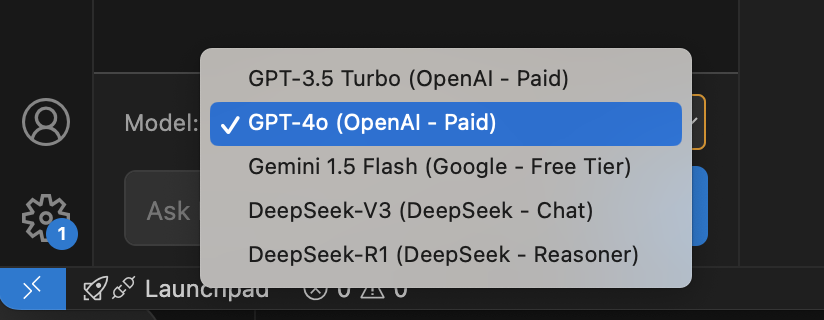

# MIB CodePilot for VS Code

Your intelligent and versatile coding assistant, MIB CodePilot, integrated directly into Visual Studio Code. Supercharge your workflow with AI-powered chat, code suggestions, and assistance from your choice of leading LLM providers.

*(Ensure your screenshot at `./assets/mib-codepilot-showcase.png` is up-to-date to show the new model selector!)*

## Features

*   **Multi-LLM Support:** Choose your preferred AI model from a range of providers:
    *   **OpenAI:** GPT-3.5 Turbo, GPT-4o
    *   **Google:** Gemini 1.5 Flash
    *   **DeepSeek:** DeepSeek-V3 (Chat), DeepSeek-R1 (Reasoner)
*   **Model Selection UI:** Easily switch between configured LLMs using a dropdown menu in the chat input area.
    
    *(Showcasing the available LLM options)*
*   **AI-Powered Chat:** Engage in natural language conversations with your chosen AI to ask questions, get explanations, and brainstorm ideas.
*   **Contextual Code Assistance:** Send selected text from your editor directly to the chat for analysis or modification.
*   **Chat History:**
    *   View and revisit previous conversations.
    *   Clearly identify the currently active chat.
    *   See which LLM model was last used for each conversation.
    *   Delete unwanted chat sessions.
*   **Dynamic Welcome Screen:** A vibrant and engaging welcome message with a typing animation.
*   **Markdown Support:** Bot responses are rendered with markdown for better readability, including code blocks.
*   **Configurable API Keys:** Securely store and use your API keys for OpenAI, Google Gemini, and DeepSeek via VS Code settings.
*   **Intuitive UI:**
    *   User and bot messages are clearly distinguished.
    *   Full-width message separators for a clean look.
    *   Auto-resizing input area for comfortable message composing.

## Requirements

*   An active API key for each LLM provider you wish to use (OpenAI, Google AI Studio for Gemini, DeepSeek).

## Extension Settings

This extension contributes the following settings. Configure them via VS Code Settings (File > Preferences > Settings or Code > Settings > Settings), then search for "MIB CodePilot":

*   `mib-codepilot-vscode.openai.apiKey`: Your OpenAI API key for GPT models.
*   `mib-codepilot-vscode.gemini.apiKey`: Your Google AI Studio API key for Gemini models.
*   `mib-codepilot-vscode.deepseek.apiKey`: Your DeepSeek API key for DeepSeek models.

You can configure these by going to VS Code Settings (File > Preferences > Settings or Code > Settings > Settings), searching for "MIB CodePilot", and entering your API keys in the respective fields.

## Commands

*   `MIB CodePilot: New Chat` (Ctrl+Shift+P or Cmd+Shift+P, then type command): Starts a new chat session.
*   `MIB CodePilot: View Chat History` (Ctrl+Shift+P or Cmd+Shift+P, then type command): Opens a list of your past conversations to load or delete.
*   `MIB CodePilot: Send Selected Text to Chat` (Ctrl+Shift+P or Cmd+Shift+P, then type command, or via context menu): Sends the currently selected text in your active editor to the MIB CodePilot input field.

## How to Use

1.  **Install the Extension:** Find "MIB CodePilot" in the VS Code Marketplace and click install.
2.  **Configure API Key:**
    *   Open VS Code Settings.
    *   Search for `MIB CodePilot` to find the API key settings.
    *   Enter your API key for each service (OpenAI, Gemini, DeepSeek) you plan to use.
3.  **Open MIB CodePilot:** Click on the MIB CodePilot icon in the Activity Bar (Sidebar).
4.  **Start Chatting:**
    *   Select your desired LLM model from the dropdown above the input area.
    *   Type your questions or prompts in the input area at the bottom of the MIB CodePilot panel.
    *   Use the "New Chat" command or the "+" button in the panel's title bar to start fresh conversations.
    *   Use the "View Chat History" command to manage and revisit old chats.

## Supported Models (UI Options)

*   **OpenAI:**
    *   GPT-3.5 Turbo (Paid)
    *   GPT-4o (Paid)
*   **Google:**
    *   Gemini 1.5 Flash (Free Tier)
*   **DeepSeek:**
    *   DeepSeek-V3 (DeepSeek - Chat)
    *   DeepSeek-R1 (DeepSeek - Reasoner)

*(Note: "Free Tier" / "Paid" / "Check Pricing" are indicative; always refer to the respective provider's current terms.)*

## Known Issues

*   Currently, no known major issues. Please report any bugs or unexpected behavior on the GitHub Issues page *(Replace with your actual GitHub repo link)*.

## Release Notes

*(Keep this section updated with each new version you publish. Example:)*

### 0.2.0 (Example - Multi-LLM Update)
*   Added support for multiple LLM providers: OpenAI, Google Gemini, and DeepSeek.
*   Introduced a model selection dropdown in the UI.
*   Chat history now displays the model used for each conversation.
*   Refactored LLM calls into a modular service architecture.

### 0.1.0 (Example - Initial Release)

*   Initial release of MIB CodePilot.
*   Core chat functionality with OpenAI.
*   Chat history management.
*   Welcome screen and basic UI.

---

## Development

*(Optional: Add notes here if you want others to contribute or if you want to remember how to set up the dev environment)*

1.  Clone the repository.
2.  Run `npm install`.
3.  Open in VS Code.
4.  Press `F5` to launch the Extension Development Host.

## Contributing

Contributions, issues, and feature requests are welcome! Feel free to check the issues page *(Replace link)*.

## License

*(Specify your license here, e.g., MIT)*

---

**Enjoy coding with MIB CodePilot!**