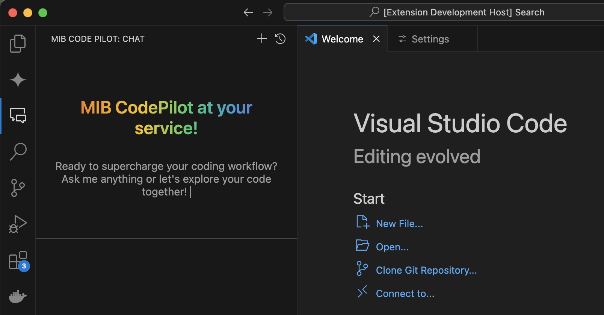

# MIB CodePilot for VS Code

Your intelligent coding assistant, MIB CodePilot, integrated directly into Visual Studio Code. Supercharge your workflow with AI-powered chat, code suggestions, and more.

## Features

*   **AI-Powered Chat:** Engage in natural language conversations with an AI to ask questions, get explanations, and brainstorm ideas.
*   **Contextual Code Assistance:** Send selected text from your editor directly to the chat for analysis or modification.
*   **Chat History:**
    *   View and revisit previous conversations.
    *   Clearly identify the currently active chat.
    *   Delete unwanted chat sessions.
*   **Dynamic Welcome Screen:** A vibrant and engaging welcome message with a typing animation.
*   **Markdown Support:** Bot responses are rendered with markdown for better readability, including code blocks.
*   **Configurable API Key:** Securely store and use your OpenAI API key via VS Code settings.
*   **Intuitive UI:**
    *   User and bot messages are clearly distinguished.
    *   Full-width message separators for a clean look.
    *   Auto-resizing input area for comfortable message composing.

## Requirements

*   An active OpenAI API key.

## Extension Settings

This extension contributes the following settings:

*   `mib-codepilot-vscode.openai.apiKey`: Your OpenAI API key. This is required for the extension to communicate with the OpenAI API.

You can configure this by going to VS Code Settings (File > Preferences > Settings or Code > Settings > Settings), searching for "MIB CodePilot", and entering your API key in the "Openai: Api Key" field.

## Commands

*   `MIB CodePilot: New Chat` (Ctrl+Shift+P or Cmd+Shift+P, then type command): Starts a new chat session.
*   `MIB CodePilot: View Chat History` (Ctrl+Shift+P or Cmd+Shift+P, then type command): Opens a list of your past conversations to load or delete.
*   `MIB CodePilot: Send Selected Text to Chat` (Ctrl+Shift+P or Cmd+Shift+P, then type command, or via context menu): Sends the currently selected text in your active editor to the MIB CodePilot input field.

## How to Use

1.  **Install the Extension:** Find "MIB CodePilot" in the VS Code Marketplace and click install.
2.  **Configure API Key:**
    *   Open VS Code Settings.
    *   Search for `MIB CodePilot OpenAI Api Key`.
    *   Enter your OpenAI API key.
3.  **Open MIB CodePilot:** Click on the MIB CodePilot icon in the Activity Bar (Sidebar).
4.  **Start Chatting:**
    *   Type your questions or prompts in the input area at the bottom of the MIB CodePilot panel.
    *   Use the "New Chat" command or the "+" button in the panel's title bar to start fresh conversations.
    *   Use the "View Chat History" command to manage and revisit old chats.

## Known Issues

*   Currently, no known major issues. Please report any bugs or unexpected behavior on the GitHub Issues page *(Replace with your actual GitHub repo link)*.

## Release Notes

### 0.1.0 (Initial Release - Example)

*   Initial release of MIB CodePilot.
*   Core chat functionality with OpenAI.
*   Chat history management.
*   Welcome screen and basic UI.

*(Keep this section updated with each new version you publish)*

---

## Development

*(Optional: Add notes here if you want others to contribute or if you want to remember how to set up the dev environment)*

1.  Clone the repository.
2.  Run `npm install`.
3.  Open in VS Code.
4.  Press `F5` to launch the Extension Development Host.

## Contributing

Contributions, issues, and feature requests are welcome! Feel free to check the issues page *(Replace link)*.

## License

*(Specify your license here, e.g., MIT)*

---

**Enjoy coding with MIB CodePilot!**